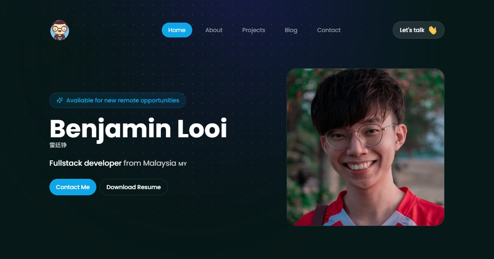

# Benjamin Looi Portfolio



Welcome to my portfolio repository! This project showcases my work, skills, and projects using modern technologies to create a highly performant, mobile-responsive, and beautifully designed portfolio site.

---

## Features

- **Performant**: Built with optimized code to ensure fast load times and smooth performance.
- **Mobile Responsive**: Fully responsive design for seamless user experience across devices.
- **Beautiful UI**: Crafted with attention to detail and aesthetics using Radix UI and Tailwind CSS.
- **Side Projects Directory**: A clean, scannable list of minor projects and tools.
- **Blog Search & Filtering**: Fast, client-side search for technical articles.
- **Comments System**: Integrated Giscus (GitHub Discussions) for community interaction.
- **Smart Content Linking**: Automatically relates blog posts and projects using a similarity-scoring engine.
- **Highly SEO Optimized**: Structured Data (JSON-LD), automatic Sitemap, and RSS feed generation.

---

## Tech Stack

- **[Next 16](https://nextjs.org/)**: Framework for server-rendered React applications.
- **[React 19](https://react.dev/)**: The latest version of React with improved performance and features.
- **[TypeScript](https://www.typescriptlang.org/)**: Typed JavaScript for enhanced developer experience and code quality.
- **[Tailwind CSS](https://tailwindcss.com/)**: Utility-first CSS framework for styling.
- **[Radix UI](https://www.radix-ui.com/)**: Accessible and unstyled UI primitives.
- **[Motion](https://www.motion.dev/)**: Library for animations and interactive UI.
- **[Remote MDX](https://mdxjs.com/)**: For rendering Markdown and JSX in the same file.
- **[Giscus](https://giscus.app/)**: A comments system powered by GitHub Discussions.
- **[PostHog](https://posthog.com/)**: Analytics platform for understanding user behavior.

---

## Getting Started

### Prerequisites

Ensure you have the following installed:

- Node.js
- pnpm

### Installation

1. Clone the repository:

   ```bash
   git clone https://github.com/benjaminlooi/portfolio-2026

   cd portfolio-2026
   ```

2. Install dependencies:

   ```bash
   pnpm install
   ```

3. Run the development server:

   ```bash
   pnpm dev
   ```

4. Open [http://localhost:3000](http://localhost:3000) in your browser to view the project.

### Build for Production

To generate a static build:

```bash
pnpm run build
pnpm run start
```

---

## Contributing

Contributions are appreciated! Feel free to open issues for suggestions or feedback, but I won't be accepting pull requests as I prefer building this myself. You're welcome to use this portfolio as a template for your own with any customizations you like.

---

## Acknowledgements

- **Next.js** for an amazing React framework.
- **Tailwind CSS** for utility-first styling.
- **Radix UI** for accessible and customizable components.
- **Motion** for smooth animations.
- **Giscus** for the comments system.
- **PostHog** for insightful analytics.

## Connect with Me

- Portfolio: [benjaminlooi.dev](https://benjaminlooi.dev)
- Instagram: [benjaminlooi](https://instagram.com/benjaminlooi)
- Twitter(𝕏): [benjaminlooi_](https://twitter.com/benjaminlooi_))
- LinkedIn: [benjaminlooi](https://www.linkedin.com/in/benjaminlooi/)
